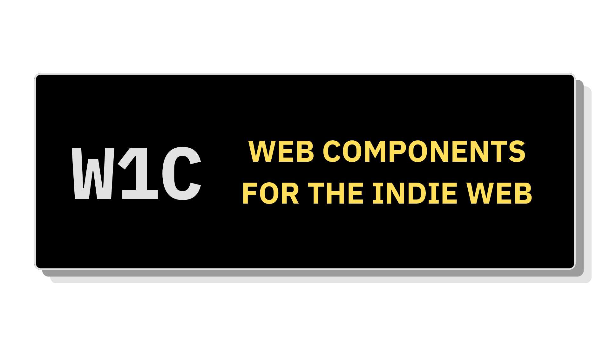

W1C is a retro OS and early-web interface inspired web component library.

## Development

### Workspace

W1C is a pnpm workspace with a Lit component package, a public SvelteKit docs app, a
Storybook workshop, and a small scaffolding CLI.

```sh
packages
  ├── lib         # @w1c/components   Lit + Vite web component library
  ├── fonts       # @w1c/fonts        Theme font CSS and vendored font assets
  ├── dnd         # @w1c/dnd          Drag, resize, and geometry primitives
  ├── cli         # @w1c/cli          Scaffolding/bootstrap CLI
  ├── docs        # @w1c/docs         Public documentation app
  └── storybook   # @w1c/storybook    Web Components Storybook app
```

### Tech Stack

Web Components use TypeScript & Lit with Vite.

The doc site is made with SvelteKit.

The CLI uses bomb.sh libraries & tsdown.

Testing is handled with Vitest & Playwright; code quality & formatting with ESLint & Prettier.

### Pre-Reqs

- Node.js
- pnpm

```sh
pnpm install
```

### Local Dev

You can filter by package name with `pnpm --filter @w1c/{name} ...`

For example, to run the documentation or storybook projects:

```sh
pnpm --filter @w1c/docs dev
```

```sh
pnpm --filter @w1c/storybook dev
```

`package.json` commands follow common conventions for `dev`, `test`, `build`, `check`, `format`

## Usage

Register every stable component:

```ts
import '@w1c/components';
```

Register one component:

```ts
import '@w1c/components/window';
```

Theme CSS and optional page styles are separate imports. Theme CSS loads the matching font package automatically:

```ts
import '@w1c/components/themes/windows-95.css';
import '@w1c/components/styles/native.css';
import '@w1c/components/styles/utilities.css';
```

Load every bundled theme font directly when a docs or preview app needs to switch typography without switching component themes:

```ts
import '@w1c/fonts/all.css';
```

## Theme Typography

| Theme       | Headings        | UI            | Code          | Source                                                |
| ----------- | --------------- | ------------- | ------------- | ----------------------------------------------------- |
| Windows 95  | IBM Plex Serif  | IBM Plex Sans | IBM Plex Mono | [Fontsource](https://fontsource.org/)                 |
| GNOME 2     | Ubuntu          | Ubuntu        | Ubuntu Mono   | Fontsource                                            |
| Ubuntu 8.10 | Ubuntu          | Ubuntu        | Ubuntu Mono   | Fontsource                                            |
| Geocities   | Comic Relief    | Comic Neue    | Comic Neue    | Fontsource                                            |
| Classic Mac | ChiKareGo2      | ChicagoFLF    |               | [system.css](https://github.com/sakofchit/system.css) |
|             |                 |               | Anonymous Pro | Fontsource                                            |
| Web 1.0     | Times New Roman | Arial         | Courier New   | System Fonts[^1]                                      |

## Further Reading

- [ROADMAP.md](./ROADMAP.md): project contract and implementation phases.
- [RESEARCH.md](./RESEARCH.md): research notes on reference studies, web component
  libraries, and Web 1.0 / Geocities aesthetics.
- [ibex](https://tangled.org/desertthunder.dev/ibex)
- [tempest](https://tangled.org/desertthunder.dev/tempest)

## References

- [Bolt Design System](https://boltdesignsystem.com/)
- [Web Awesome](https://webawesome.com/)
- [Nord Design System Web Components](https://nordhealth.design/components/)
- [Freshworks Crayons](https://crayons.freshworks.com/)

### Web 1.0

- [GeoCities](https://en.wikipedia.org/wiki/GeoCities)
- [Web 1.0](https://en.wikipedia.org/wiki/Web_2.0#Web_1.0)
- [History of web design](https://en.wikipedia.org/wiki/Web_design)
- [Tableless web design](https://en.wikipedia.org/wiki/Tableless_web_design)
- [Ghost Pages: A Wired.com Farewell to GeoCities](https://www.wired.com/2009/11/geocities)
- [The indie web is here...](https://www.theverge.com/column/829831/indie-web-geocities-neocities)

### Colors

- [Reasonable Colors](https://github.com/matthewhowell/reasonable-colors)
- [Uchu color system](https://code.webb.page/nevercease/uchu.git/about/)

### Icons

- [OpenMoji icon set](https://icon-sets.iconify.design/openmoji/)
- [Twemoji icon set](https://icon-sets.iconify.design/twemoji/)
- [FxEmoji icon set](https://icon-sets.iconify.design/fxemoji/)
- [Bootstrap Icons](https://icons.getbootstrap.com/)
- [Ubuntu Humanity icon theme](https://github.com/mk-pmb/ubuntu-icon-theme-humanity)
- [Iconify icon data](https://iconify.design/docs/icons/icon-data.html)
- [icondata](https://github.com/carloskiki/icondata)

[^1]: if you have different defaults in your browser, these'll look different.
